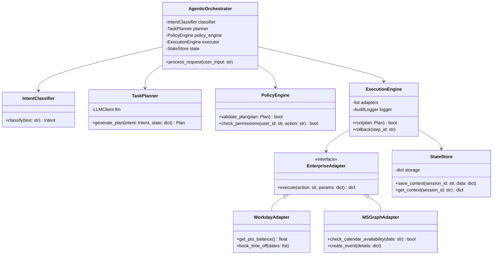

```mermaid
classDiagram
    class AgenticOrchestrator {
        -IntentClassifier classifier
        -TaskPlanner planner
        -PolicyEngine policy_engine
        -ExecutionEngine executor
        -StateStore state
        +process_request(user_input: str)
    }

    class IntentClassifier {
        +classify(text: str) Intent
    }

    class TaskPlanner {
        -LLMClient llm
        +generate_plan(intent: Intent, state: dict) Plan
    }

    class PolicyEngine {
        +validate_plan(plan: Plan) bool
        +check_permissions(user_id: str, action: str) bool
    }

    class ExecutionEngine {
        -list adapters
        -AuditLogger logger
        +run(plan: Plan) bool
        +rollback(step_id: str)
    }

    class EnterpriseAdapter {
        <<interface>>
        +execute(action: str, params: dict) dict
    }

    class WorkdayAdapter {
        +get_pto_balance() float
        +book_time_off(dates: list)
    }

    class MSGraphAdapter {
        +check_calendar_availability(date: str) bool
        +create_event(details: dict)
    }

    class StateStore {
        -dict storage
        +save_context(session_id: str, data: dict)
        +get_context(session_id: str) dict
    }

    AgenticOrchestrator --> IntentClassifier
    AgenticOrchestrator --> TaskPlanner
    AgenticOrchestrator --> PolicyEngine
    AgenticOrchestrator --> ExecutionEngine
    ExecutionEngine --> EnterpriseAdapter
    EnterpriseAdapter <|-- WorkdayAdapter
    EnterpriseAdapter <|-- MSGraphAdapter
    ExecutionEngine --> StateStore
```