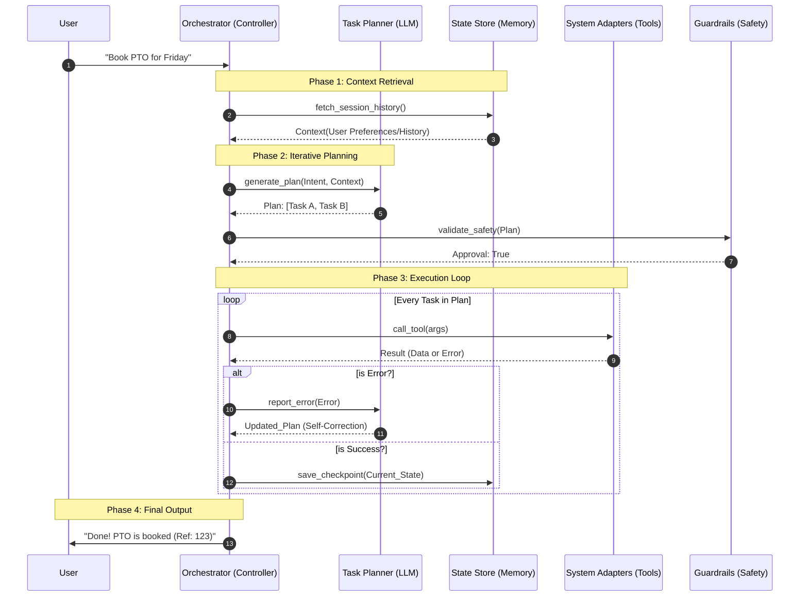
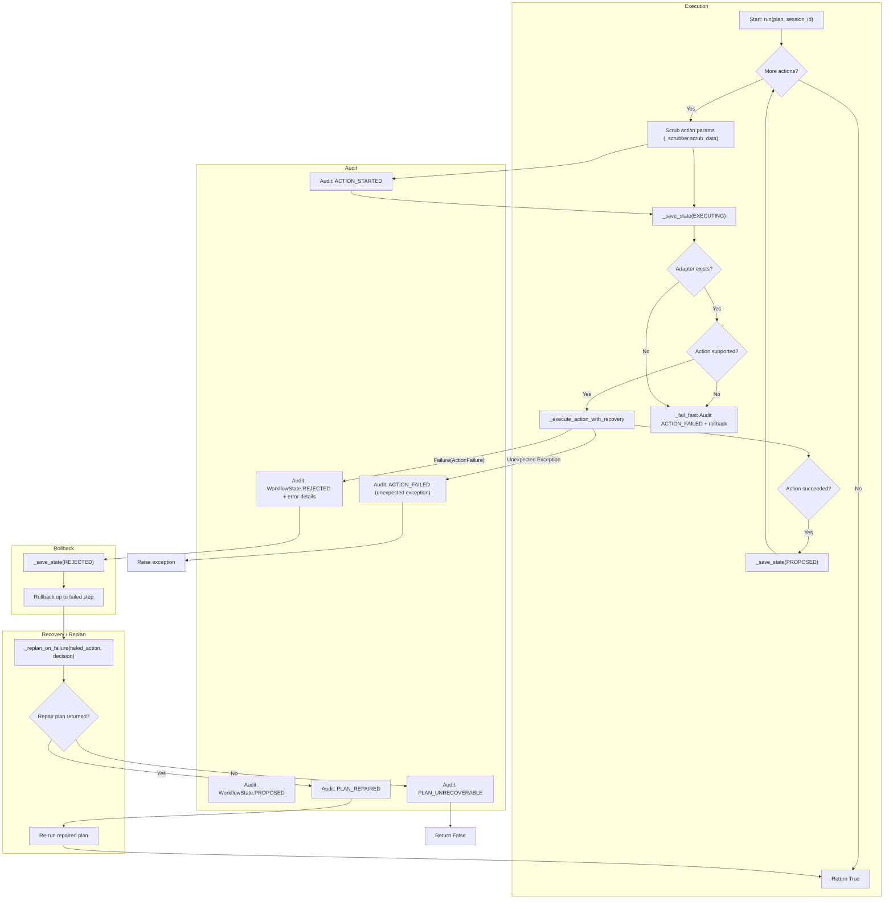

# POC: Agentic Workflow Automation

### Enterprise HR & Workspace Orchestration

## Problem Statement

In large enterprises, "Agentic AI" often fails because it is treated as a black box. Without **Human-in-the-Loop (HITL)** controls, **State Management**, and **Policy Enforcement**, autonomous agents represent a significant security and operational risk.

This POC demonstrates a structured orchestration layer that safely bridges LLM reasoning with protected Enterprise APIs (Workday, MS Graph).

---

## System Architecture

### Class Relationship Diagram

This POC uses an Object-Oriented approach to separate intent classification from execution, ensuring the system is "Open/Closed"—new adapters can be added without modifying the core logic.


---

## Execution Flow

The following sequence highlights the **Authorization Gate**. The system will not call an Enterprise API until the user has confirmed the "Proposed Plan" and the Policy Engine has verified permissions.



---

## Key Technical Features

* **Human-in-the-Loop (HITL):** A mandatory confirmation step between the *Reasoning* and *Execution* phases.
* **Identity Propagation:** Logic designed to carry user tokens through to adapters (mocked in this POC).
* **State Awareness:** The orchestrator maintains a `StateStore` to handle multi-turn conversations (e.g., "Wait, move it to Monday instead").
* **Policy-as-Code:** A dedicated engine that checks the generated plan against enterprise constraints before execution.

---

## Design Principles

* **Single Responsibility:** The Planner reasons, the Policy Engine validates, and the Adapters execute. No cross-contamination.
* **Fail-Fast:** If the Policy Engine rejects a plan, execution is halted before a single API call is made.
* **Audit-by-Design:** Every state transition in the `StateStore` is an immutable event, providing a natural audit trail.

--- 

## 📁 Project Structure
- `orchestrator.py`: Core logic and service coordination.
- `models/`: Dataclasses for `Intent`, `Plan`, and `Action`.
- `engines/`: Implementation of `TaskPlanner` and `PolicyEngine`.
- `adapters/`: Individual wrappers for Workday and MS Graph APIs.
- `store/`: State and context management.

---

## ExecutionEngine Flow

This diagram shows the flow of execution for the `ExecutionEngine.run()` method, including action execution, rollback, and self-correction via `_replan_on_failure`.



## Getting Started

### Prerequisites

* Python 3.9+
* `pip install -r requirements.txt`

### Running the POC

```bash
python main.py

```
