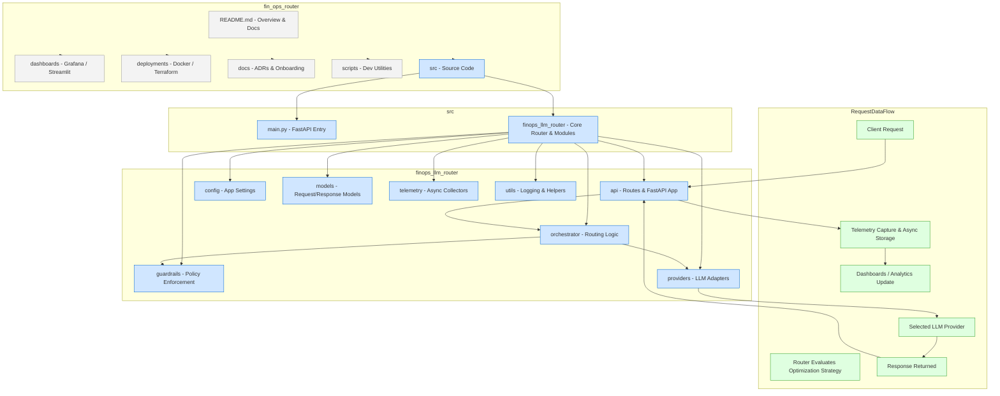
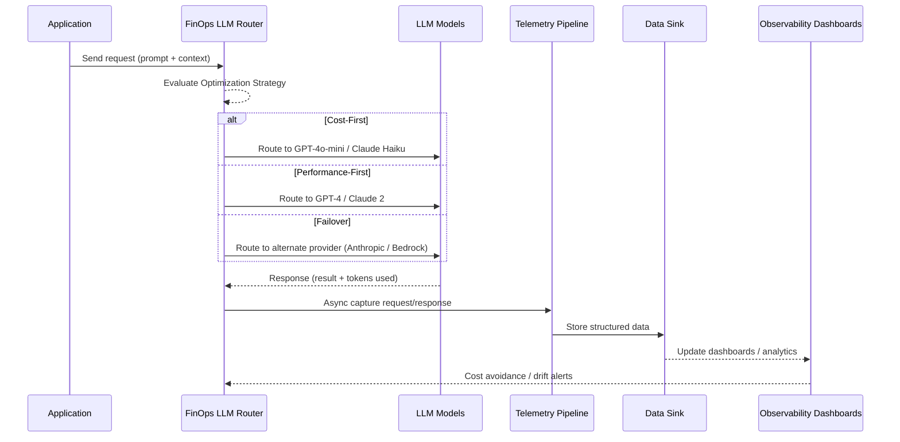

# FinOps: Intelligent LLM Router & Telemetry Engine

## The Problem: "Token Sprawl"
In most enterprises, LLM adoption starts as a "wild west." Developers naturally gravitate toward the most powerful models for every task, leading to skyrocketing costs without clear ROI. 

**FinOps-Router** is a Control Plane for Generative AI. It stops "token sprawl" by treating AI usage as a measurable, optimizable business expense rather than an unmanaged utility.

---

## Architectural Pillars

### 1. Intelligent Routing (Smart Logic, Not Hardcoding)
Instead of hardcoding model endpoints, your apps point to this router. It evaluates every incoming request against a specific **Optimization Strategy**:

* **Cost-First:** Routine tasks (summarization, formatting) are automatically routed to lightweight models like `GPT-4o-mini` or `Claude Haiku`.
* **Performance-First:** Complex reasoning or sensitive coding tasks are escalated to frontier models.
* **Operational Resilience:** If Azure OpenAI hits a rate limit or goes down, the router automatically fails over to Anthropic or Bedrock to maintain your SLAs.

### 2. The Telemetry Pipeline (Data-Driven Decisions)
We treat LLM interactions as first-class data products. We don't just "log" data; we capture the unit economics of every prompt:

* **Async Collection:** Every request/response cycle is intercepted asynchronously to ensure we don't add latency to the user experience.
* **Data Durability:** Telemetry is pushed to structured sinks (**PostgreSQL/DuckDB**), making it easy to integrate into Snowflake or BigQuery for board-level reporting.
* **Unit Economics:** We move beyond "cost per million tokens" to calculate the actual **"Cost-per-Business-Outcome."**

### 3. Economic Observability
Get real-time visibility into your AI "Burn Rate" before the bill arrives:

* **Savings Audit:** A built-in logic layer that calculates **Cost Avoidance**—the delta between using a frontier model vs. the routed optimized model.
* **Drift Detection:** Monitor for sudden spikes in latency or costs across specific teams or use cases.



## Execution Flow

The sequence diagram illustrates the lifecycle of a request through the FinOps LLM Router and Telemetry Engine:

1. **Application Sends Request** – The app sends a prompt or task to the FinOps LLM Router.

2. **Router Evaluates Strategy** – The router checks the Optimization Strategy configured for this type of task (Cost-First, Performance-First, or Failover).

3. **Routing to LLM Model** –

   - Cost-First: Sends routine tasks to lightweight models like GPT-4o-mini or Claude Haiku. 
   - Performance-First: Sends complex or sensitive tasks to frontier models such as GPT-4 or Claude 2. 
   - Failover: If a provider is down or throttled, the router automatically routes to an alternate provider (Anthropic, Bedrock).

4. Model Returns Response – The selected LLM executes the task and returns the output, along with token usage statistics.

5. Telemetry Capture – The router asynchronously sends the request and response data to the telemetry pipeline without impacting latency.

6. Data Storage & Analysis – Telemetry is stored in structured data sinks (PostgreSQL or DuckDB) and analyzed to calculate business outcomes, cost avoidance, and drift detection.

7. Dashboard Updates – Observability dashboards (Grafana, Streamlit) are updated in real time to provide visibility into AI usage, costs, and system health.


---

## The "Paved Path" for Scale
A Director's role is to reduce friction. This repository is designed as a template to help teams move fast without breaking the budget:

* **Standardized Interfaces:** Teams use a single API specification. You can swap providers in the background without a single line of code changing in the downstream app.
* **Self-Service Policies:** Includes an onboarding guide for team leads to define their own routing logic in simple config files.
* **ADR Log:** Located in `/docs`, detailing the trade-offs we made between proxy-based vs. library-based orchestration.

---

## Tech Stack
* **Language:** Python 3.11+ (FastAPI) / Go (for high-throughput proxying)
* **State Management:** **Redis** for rate limiting and semantic caching (don't pay for the same prompt twice).
* **Observability:** **Prometheus & Grafana** for metrics; **Streamlit** for the executive dashboard.
* **Data Sink:** **DuckDB** (for local analytics) or **PostgreSQL** (for persistence).
* **Infrastructure:** Docker-ready and managed via Terraform.

---

## Leadership & Contribution
This POC serves as a reference implementation for engineering managers. By standardizing the "how" of LLM integration, we move from fragmented experimentation to a unified **Enterprise AI Platform strategy.**

---

## Strategic Overview:
The FinOps LLM Router POC provides enterprise teams with a control plane for AI usage, turning LLM interactions into 
measurable, optimizable business outcomes. By intelligently routing requests, capturing telemetry asynchronously, 
and surfacing cost and performance insights, this system ensures operational resilience, cost efficiency, 
and data-driven decision-making at scale. This POC demonstrates a repeatable, enterprise-ready template for 
integrating multiple AI providers while maintaining control over spend and service quality.

---

## Project Structure

The FinOps LLM Router POC is organized to support scalable, enterprise-grade LLM integrations. Each folder serves a clear purpose, making it easy for teams to adopt, extend, and monitor usage.

```mermaid
fin_ops_router/
├── README.md                # Project overview and documentation
├── dashboards/              # Grafana / Streamlit dashboards or SQL queries
├── deployments/             # Dockerfiles, docker-compose, Terraform manifests
├── docs/                    # ADRs, onboarding guides, config examples
├── scripts/                 # Dev scripts (DB init, seed data, telemetry replay)
├── src/                     # Source code
│   ├── __init__.py
│   ├── main.py              # Entry point for FastAPI app
│   └── finops_llm_router/
│       ├── api/            # API endpoints
│       │   └── routes/     # API route definitions
│       ├── config/         # Configuration management
│       ├── guardrails/     # Guardrails and policy enforcement
│       ├── models/         # Data models and schemas
│       ├── orchestrator/   # LLM orchestrator logic
│       ├── providers/      # LLM provider adapters
│       ├── telemetry/      # Telemetry and monitoring
│       └── utils/          # Utility functions and helpers
│           
└── tests/                   # Unit and integration tests

```

## Dashboards & Observability

This POC includes a **Streamlit-based LLM FinOps Dashboard** for monitoring AI usage, costs, latency, and guardrail compliance in real time.  

For detailed instructions on running the dashboard locally, see the [dashboards/README.md](dashboards/README.md).

### Dashboard Overview


*Example view showing requests, spend, average latency, fallbacks, provider failures, and guardrail violations.*
